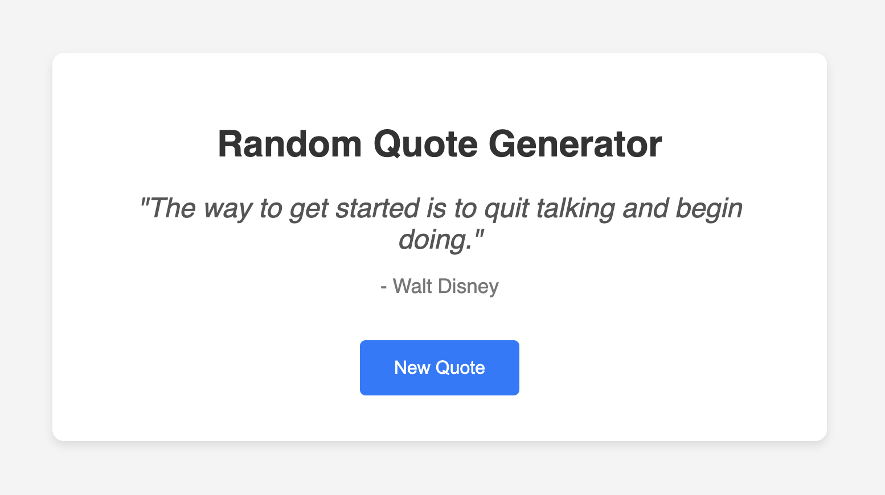

# 🎯 JavaScript Random Quote Generator

A simple and elegant JavaScript project that displays random quotes to inspire, motivate, or amuse you! Built using HTML, CSS, and JavaScript.

## ✨ Features

- Displays a new quote each time a button is clicked
- Quotes are chosen randomly from a predefined array
- Clean, responsive design
- Easy to customize with your own quotes or styles

## 🚀 Demo

[Live Demo](#) — https://biswajit-adhikary.github.io/JavaScript-Random-Quote-Generator/

## 📸 Screenshot

## 🛠️ Technologies Used

- HTML5
- CSS3
- JavaScript (Vanilla)
